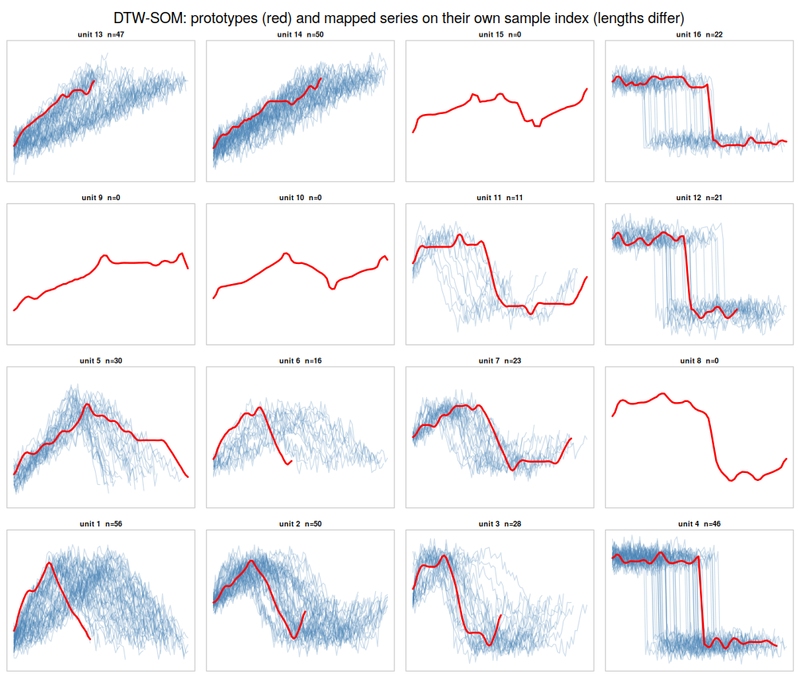
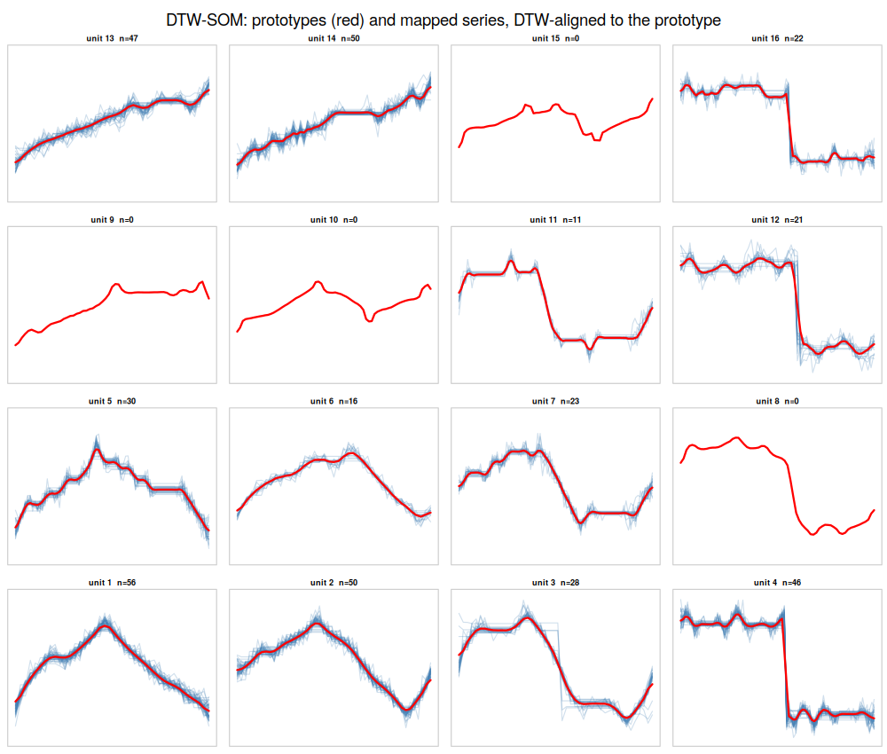
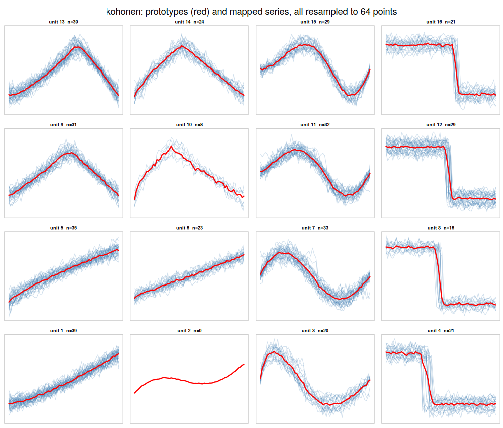

# dtwsom — Self-Organizing Maps for variable-length time series (DTW, Rcpp, OpenMP)

A self-organizing map whose prototypes are time series of *arbitrary length*. Series are matched
with dynamic time warping and prototypes are adapted along the optimal warping path, following
Silva & Henriques (2020), *Exploring time-series motifs through DTW-SOM* ([arXiv:2004.08176](https://arxiv.org/abs/2004.08176)).

What this implementation adds to the paper:

* a deterministic **batch mode** (neighbourhood-weighted DBA barycenters) that parallelises over
  the series with OpenMP — the paper's online algorithm is also available (`mode = "online"`);
* Sakoe-Chiba bands, `max_step`, early abandoning with the paper's per-epoch `max_dist` trick and a
  running best bound — pruning is exact (bit-identical results with `prune = FALSE`);
* multivariate series (dependent DTW), optional prototype smoothing (`smooth = 3`), z-normalisation;
* the number type is chosen at run time: `precision = "float" | "double" | "longdouble" | "quad" | "bin50" | "mpfr100"`
  (Boost.Multiprecision via the `BH` package; MPFR optional);
* quantization/topographic error, U-matrix, hit maps, prototype–member overlays, an "elastic" layout,
  and `as_kohonen()` so [`aweSOM`](https://cran.r-project.org/package=aweSOM) can evaluate and plot the map.

With `window = 0` on fixed-length data the algorithm reduces exactly to a batch Euclidean SOM and
reproduces `kohonen::som(mode = "batch")` to 10⁻¹⁶ (see `inst/examples/example_compare.R`).

## Install

```r
install.packages(c("Rcpp", "BH"))                      # kohonen, aweSOM, MASS optional
remotes::install_github("andrii-patrikei/dtwsom")
```

Needs a C++17 compiler with OpenMP (Rtools on Windows, gcc/clang elsewhere). For full speed on your
own machine put `CXX17FLAGS = -O3 -march=native` in `~/.R/Makevars` before installing.

## Quick start

```r
library(dtwsom)
x <- lapply(1:300, function(i) sin(seq(0, 2 * pi, length.out = sample(40:90, 1))) + rnorm(1, sd = .1))  # any lengths

fit <- dtw_som(x, xdim = 4, ydim = 4, epochs = 30, window = 10, smooth = 3)
fit                          # QE, TE, hits per unit
plot(fit, "members")         # red prototype + the series mapped to it, on their own sample index
plot(fit, "members_dtw")     # the same series warped onto the prototype's time axis
plot(fit, "umatrix"); plot(fit, "counts"); plot(fit, "elastic")
predict(fit, x[1:5])$bmu

# kohonen / aweSOM interoperability
k <- as_kohonen(fit)
aweSOM::somQuality(k, k$data[[1]]); aweSOM::aweSOMplot(k, "Hitmap")
```

| members on their own index | members DTW-aligned to the prototype | kohonen (all resampled to one length) |
|---|---|---|
|  |  |  |

## When does DTW beat a Euclidean SOM?

Same initial codebook and radius schedule, five initialisations each (`inst/examples/example_compare.R`):

| data | kohonen purity | DTW-SOM purity |
|---|---|---|
| synthetic motifs, smooth *global* time-stretch, resampled to 64 | 0.987 | 1.000 |
| Cylinder-Bell-Funnel — *local* onset/duration misalignment | 0.871 | 0.981 |

Resampling to a common length already removes a global stretch, so the classical SOM does as well there
(and has the smoother map). DTW pays off when instances of one class differ in onset and local tempo —
the situation repeated movements in sensor data are in.

## Contents

```
R/dtwsom.R              dtw_som(), predict/plot/print, as_kohonen(), elastic_layout(), plot_members()...
src/dtwsom_core.hpp     R-free C++17 + OpenMP core, templated on the number type
src/dtwsom_rcpp.cpp     Rcpp bindings with run-time precision dispatch
src/dtw_lanes.cpp       SIMD-across-prototypes DTW kernel (AVX-512 demo, no intrinsics; 15-28x vs scalar)
inst/examples/          example.R, example_compare.R (iris/kohonen/aweSOM/CBF), precision_test.Rmd
cpp_tests/              standalone g++ tests of the core (DTW vs brute force, pruning, all number types)
docs/PLAN.md            design notes, measurements, roadmap (GPU, LB_Keogh, soft-DTW, ...)
```

Standalone core tests: `g++ -std=c++17 -O2 -fopenmp cpp_tests/test_core.cpp -o t && ./t`.

## References

* M. I. Silva, R. Henriques (2020). Exploring time-series motifs through DTW-SOM. *IJCNN 2020*.
  Reference Python code: https://github.com/misilva73/dtw_som
* F. Petitjean, A. Ketterlin, P. Gançarski (2011). A global averaging method for dynamic time warping (DBA).
* N. Saito (1994). Cylinder-Bell-Funnel synthetic benchmark.
* R. Wehrens, J. Kruisselbrink (2018). Flexible self-organizing maps in kohonen 3.0. *J. Stat. Soft.*

## License

GPL-3. Algorithm after Silva & Henriques (MIT reference implementation, not copied).
